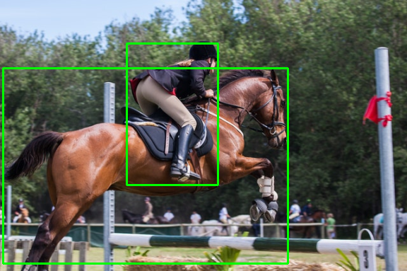

# Blob Segmentation
> Performs object detection and extracts coloured blogs of input images using pretrained mask rcnn model

## Table of Contents
* [Technologies Used](#technologies-used)
* [Screenshots](#screenshots)
* [Usage](#usage)
<!-- * [License](#license) -->

## Technologies Used
- Python - version 3.9.0
- OpenCV - version 4.5.5

## Screenshots

<!-- If you have screenshots you'd like to share, include them here. -->

## Usage
`python3 instance_segmentation.py`

<!-- Optional -->
<!-- ## License -->
<!-- This project is open source and available under the [... License](). -->

<!-- You don't have to include all sections - just the one's relevant to your project -->

